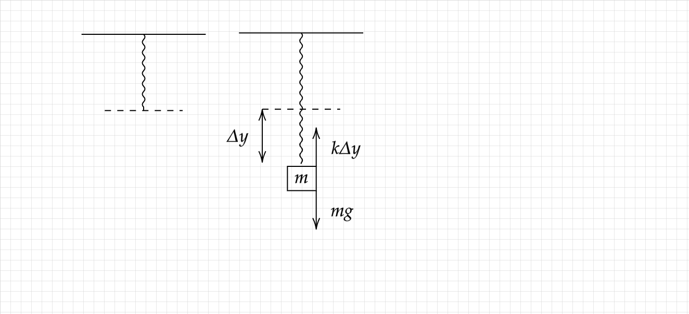

```{r setup, include=FALSE} 
knitr::opts_chunk$set(warning = FALSE, message = FALSE) 
```
```{r include=FALSE}
library(readODS)
datos = read_ods("~/Documentos/GitHub/el-archivo/Carrera/1ro (2024-25)/1er Cuatri/Física/Informes de Laboratorio/Medidas Datos Ley de Hooke.ods")
```
\tableofcontents
\newpage

# Introducción
Se va a estudiar como pruebas experimentales acerca de la ley de Hooke concuerdan con la teoría. Para ello, se han hecho diferentes experimentos, donde se estudiaban diferentes movimientos, muelles, y pesas.

# Teoría
Empezamos partiendo de la segunda ley de Newton, que afirma que la aceleración de un cuerpo viene dada por la suma de las fuerzas actuando sobre este, entre la masa total del cuerpo. Matemáticamente, esta expresión es:
$$
\boxed{\dv[2]{\vec{r}}{t} = \frac{1}{m} \sum \vec{F}}
$$
Por otro lado, la ley de Hooke afirma que la fuerza ejercida por un muelle de constante elástica $K$, sobre un objeto alejado una distancia $\Delta \vec{r}$ de la posición de equilibrio del muelle viene dada por la ecuación:
$$
\boxed{\vec{F}_{muelle} = -k\Delta \vec{r}}
$$
Para una dimensión, y sobre un objeto cuya única fuerza es la del muelle, se obtiene la siguiente EDO:
$$
m \frac{d^2x}{dt^2}=-kx
$$
Que tiene como solución:
$$
x(t)= A\sin (\sqrt{\frac{k}{m}}t)
$$
Como segunda parte del experimento, se midieron el período de las oscilaciones de los muelles con diferentes pesas. Según la ley de Hooke, la velocidad angular de un muelle de constante $k$, sujetando una masa $m$, viene dada por la ecuación:
$$
\omega = \sqrt{\frac{k}{m}}
$$
Y por tanto, el período de esta es:
$$
T = 2\pi\sqrt{\frac{m}{k}}
$$
\pagebreak

# Material y procedimiento
El material necesario para el experimento ha sido:
- Dos muelles de diferentes constantes elásticas.
- Dos punteros de plástico para medir la posición.
- Una regla milimetrada.
- Una barra soporte que sujetará los muelles.
- Base reguladora donde se apoyaría la barra soporte.
- Horquilla de donde colgar los muelles.
- Balanza de donde medir las pesas antes de colgarlas.
- Cronómetro para medir los períodos de los movimientos.
- Una serie de pesas y porta-pesas.

## Procedimiento
Para confirmar la ley de Robert Hooke, se han realizado dos tipos de experimentos. El primero ha consistido en colgar un muelle, y desde la punta, colgar una pesa de masa $m$. Se estudiará la elongación $\Delta y$ del muelle respecto a su posición de equilibrio.

### 1 - Pesa colgada de muelle
El siguiente esquema representa la situación del experimento:
<center>



</center>
A la izquierda, se observa el muelle en su posición natural, sin ninguna pesa colgada. Por su propio peso, el muelle se elonga una cierta cantidad, pero esta es despreciable para los experimentos. A la derecha, se observa una pesa colgada del muelle, separada una distancia $\Delta y$ de la posición de equilibrio del muelle. En los diferentes experimentos, se midió la distancia que se separaba el peso del muelle hasta llegar a una posición de equilibrio (es decir, en la cual el peso no se movía).
Los datos obtenidos de las diferentes mediciones son los siguientes:
```{r echo=FALSE}
muelle1 = head(datos[1:5,2:3])
muelle2 = head(datos[1:5, 10:11])
muelle3 = head(datos[1:5, 15:16])
muelle1
muelle2
muelle3
```
Para tomar las medidas, primero se colgaron los muelles, y se dejaron caer las pesas hasta su posición de equilibrio. Luego, se midió el desplazamiento respecto a la posición de equilibrio (es decir, la posición donde la parte más baja del muelle cuelga cuando no está sujetando ningún peso.).

### 2 - Período de las oscilaciones
Para la segunda parte del experimento, desde la posición de equilibrio, se desplazó (hacia arriba o hacia abajo) una distancia $A$.
<center>


</center>
Esto provocó que la fuerza ejercida por el muelle fuese mayor a la de la gravedad, y por tanto el peso comenzó a moverse en un movimiento periódico de amplitud $A$.
Luego, se observó el tiempo que tardaba la pesa en realizar 10 oscilaciones (para mayor precisión) y se dividió entre $ 10 $ para obtener el período de una oscilación individual.
Esto generó los siguientes resultados:
```{r echo=FALSE}
par(mfrow=c(2,2))
muelle1 = union(datos[1:5, 2],datos[1:5,4:5])
muelle2 = union(datos[1:5, 10],datos[1:5,12:13])
muelle3 = union(datos[1:5, 15],datos[1:5,17:18])
muelle1
muelle2
muelle3
```
\pagebreak

# Resultados
Para cada uno de los muelles, podemos crear una recta de regresión para ver la dependencia entre el desplazamiento y la masa. Según la ley de Hooke, esta dependencia debería ser lineal.
```{r echo=FALSE}
par(mfrow=(c(2,2)))
muelle1 = head(datos[1:5,2:3])
muelle2 = head(datos[1:5, 10:11])
muelle3 = head(datos[1:5, 15:16])
plot(muelle1$`Desplazamiento (mm)...3` ~ muelle1$`Masa (kg)...2`, data = muelle1,ylab = "Desplazamiento (mm)", xlab = "Masa (kg)", main="Muelle 1")
plot(muelle2$`Desplazamiento (mm)...11` ~ muelle2$`Masa (kg)...10`, data = muelle2,ylab = "Desplazamiento (mm)", xlab= "Masa (kg)", main="Muelle 2")
plot(muelle3$`Desplazamiento (mm)...16` ~ muelle3$`Masa (kg)...15`, data = muelle3,ylab = "Desplazamiento (mm)", xlab= "Masa (kg)", main="Muelles acoplados")
```
Donde se puede ver claramente una dependencia lineal entre la masa que cuelga y el desplazamiento del muelle.
Es importante tener en cuenta que para los muelles acoplados, no había una garantía de que presentasen una dependencia lineal respecto a la masa. Como se puede observar, esta dependencia está presente, y claramente los muelles acoplados se pueden aproximar como un único muelle con su propia constante elástica.
Para comparar con la ley de Hooke, vamos a establecer su ecuación, y a despejar el desplazamiento en función de la masa. Para este sistema, tenemos un objeto cuyas únicas fuerzas que actuan sobre él son su peso $mg$ y la fuerza del muelle $-k\Delta y$. Como sabemos que la pesa permanece en reposo, tenemos la siguiente ecuación:
$$
-mg + k\Delta y = 0
$$
$$
\Delta y = m \frac{g}{k}
$$
Es decir, la pendiente de nuestras rectas de regresión deberían ser igual a $\frac{g}{k}$.

### Cálculo de errores
Antes de proceder con el cálculo de las constantes, es necesaria una meditación sobre el error de la constante. Puesto que los únicos parámetros don $y$ y $m$, el error de la constante será:
$$
\Delta k = \frac{g}{y}\Delta m + \frac{mg}{y^2}\Delta y
$$
(Nota para el corrector: puesto que $m$ e $y$ son parámetros en sí mismos que cambian con cada muestra, no supe como calcular el error total de la constante, por lo que lo dejé en función de los diferentes parámetros.)
Como sabemos que $g = 9.81 ms^{-2}$, solo necesitaríamos despejar $ k$. Como tenemos una relación lineal, tomando los modelos anteriores:

Obtenemos las siguientes constantes:
$$
k_1 = \frac{g}{m_1} = 0.0191 + \Delta k ~(\frac{N}{mm}) = 19.155 + \Delta k ~(\frac{N}{m})
$$
$$
k_2 = \frac{g}{m_2} = 0.00289 + \Delta k ~(\frac{N}{mm}) = 2.8908 + \Delta k ~(\frac{N}{m})
$$
$$
k_3 = \frac{g}{m_3} = 0.002525 + \Delta k ~(\frac{N}{mm}) = 2.5277 + \Delta k~ (\frac{N}{m})
$$
Es decir, que podemos confirmar, mediante experimentos, que la ley de Hooke es consistente y capaz de recrear las observaciones.

---

Respecto a los períodos de las oscilaciones, se espera que la dependencia entre el período $T$ y la masa $m$ venga dada por $T \sim \sqrt{m}$. Si realizamos un gráfico de dispersión con el período en el eje $Y$ y la raíz cuadrada de la masa en ej ele $X$, obtenemos:
```{r echo=FALSE}
plot(datos$`Período (s)...5`, sqrt(datos$`Masa (kg)...2`), data = datos, ylab = "Masa (kg)", xlab = "Período (s)")
plot(datos$`Período (s)...13`, sqrt(datos$`Masa (kg)...10`), data = datos, ylab = "Masa (kg)", xlab = "Período (s)")
plot(datos$`Período (s)...18`, sqrt(datos$`Masa (kg)...15`), data=datos, ylab = "Masa (kg)", xlab = "Período (s)")
```
Donde se observa una clara dependencia lineal. Por tanto, teniendo la ecuación anterior, sabemos que ahora, la pendiente de esta recta viene dada por:
$$
m = 2\pi \frac{1}{\sqrt{k}}
$$
$$
k = \frac{4\pi^2}{m^2}
$$
Lo que nos permitirá sacar las constantes elásticas en función de los datos obtenidos. Las rectas de regresión son, por tanto:
```{r echo=FALSE}
m1 = lm(datos$`Período (s)...5` ~ sqrt(datos$`Masa (kg)...2`), data = datos)
m2 = lm(datos$`Período (s)...13` ~ sqrt(datos$`Masa (kg)...10`), data = datos)
m3 = lm(datos$`Período (s)...18` ~ sqrt(datos$`Masa (kg)...15`), data=datos)
m1
m2
m3
```
Y ahora sacamos las constantes:
$$
k_1 = \frac{4\pi^2}{m^2} = \frac{4\pi^2}{1.43097^2}=19.27~(\frac{N}{m}) 
$$
$$
k_2 = \frac{4\pi^2}{m^2} = \frac{4\pi^2}{3.39195^2}= 3.431417 ~(\frac{N}{m}) 
$$
$$
k_3 = \frac{4\pi^2}{m^2} =\frac{4\pi^2}{3.7342^2} = 2.831161~(\frac{N}{m}) 
$$
\pagebreak

# Discusión

Como se ha podido observar, la ley de Hooke predice correctamente las observaciones de los experimentos. Esto implica que:
* La fuerza del muelle viene dada por $\vec{F} = -k\Delta x$.
* El movimiento provocado por desplazar el peso una cantidad $A$ de la posición de equilibrio genera un movimiento armónico simple dado por la ecuación
$$
y(t)=A\sin (\omega t + \delta_0)
$$

Debido a las condiciones del experimento, existen varios errores a consecuencia de los métodos de medición:\break
* Precisión de los artilugios utilizados, como una regla, cronómetro, báscula.\break
* Errores inevitables causados a causa de ser personas quienes comenzaban y detenían la cuenta del reloj, provocados por los reflejos de los medidores.\break
* Posibles fallos o desgastes en los instrumentos.\break
Pese a esto, se han podido sacar conclusiones exitosas sobre los experimentos.\break

# Conclusión
Finalmente, podemos concluir que la ley de Hooke  se ha podido verificar experimentalmente, y que permite predecir el movimiento de sistemas afectados por muelles individuales o acoplados. Los movimientos armónicos son esenciales en numerosas áreas de la física, desde la clásica hasta la moderna (en el caso de la mecánica cuántica, muchas funciones de densidad de probabilidad se representan como movimientos armónicos).

