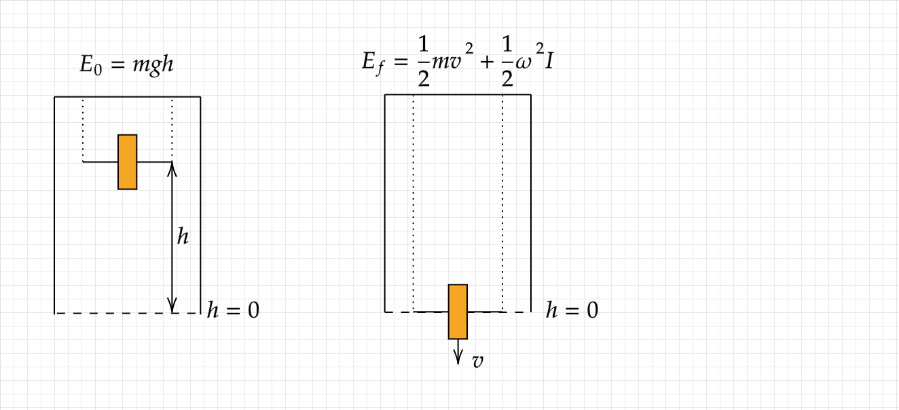

```{r include=FALSE}
library(readODS)
datos = read_ods("~/Documentos/GitHub/el-archivo/Carrera/1ro (2024-25)/1er Cuatri/Física/Informes de Laboratorio/Medidas Datos Rueda de Maxwell.ods")
```

# Intro
La rueda de Maxwell se trata de un dispositivo formado por un cilindro, una varilla que atraviesa su centro de forma perpendicular. Desde cada extremo de la varilla se encuentran dos hilos de igual longitud, de los cuales se van a enrollar la varilla para luego dejar que esta caiga, y observar su movimiento.

En este informe se tratarán las diferentes observaciones de la rueda de Maxwell y como estas confirman la ley de la conservación de la energía, además de tratar de calcular su momento de inercia.
\newpage

# Teoría
Se va a observar como un objeto se mueve a causa de la fuerza de la gravedad. Despreciando el rozamiento que ejerce la cuerda sobre el cilindro al rodar, tenemos que, la energía total que posee el cuerpo viene dada por
$$
E = T + U = \frac{1}{2}mv^2 + \frac{1}{2}\omega^2 I - mgh
$$
El signo $-$ delante de la energía potencial es para definir el origen de coordenadas en el punto desde el cual cae la rueda.
Nos interesa analizar la energía que tiene en los dos siguientes puntos:
<center>



</center>
A la izquierda se puede ver la rueda, completamente enrollada, donde solo tiene energía potencial siendo esta $E=0$. En la segunda figura, se ha dejado caer la rueda hasta que se desenrolla completamente, y tiene energía puramente cinética, más una contribución negativa de la potencial. Al ser un sólido rígido, esta energía es $E= \frac{1}{2}mv^2 + \frac{1}{2}\omega^2 I -mgh$.\hline\break
Puesto que el objeto solo puede moverse mediante el desenrolle de las cuerdas, este solo puede rodar sin deslizar, y por tanto, se cumple la ecuación:
$$
\vec{v} = \vec{\omega} \times \vec{r}
$$
Puesto que la velocidad lineal y la angular son perpendiculares, podemos simplemente tomar el módulo, obteniendo así:
$$
v=\omega r \iff \omega = \frac{v}{r}
$$
Ahora podemos sustituir en la ecuación de la energía final para obtener:
$$
E = \frac{1}{2}mv^2 + \frac{1}{2}\omega^2 I -mgh = \frac{1}{2}mv^2 + \frac{1}{2} \frac{v^2}{r^2}I -mgh= \frac{v^2}{2}(m+ \frac{I}{r^2}) -mgh
$$
En el instante en el que se deja caer, $T=0$ y $h = 0$, por lo que $E=0$, lo que nos permite despejar el momento de inercia de la ecuación, obteniendo así:
$$
I = 2m( \frac{r}{v})^2(gh - \frac{v^2}{2})
$$
Además, de las expresiones anteriores, podemos obtener la energía cinética de traslación, de rotación, y la potencial, en función del tiempo:
$$
T_T= \frac{1}{2}m(\left \frac{mgt}{m + \frac{I}{r^2}}\right)^2
$$
$$
T_R = \frac{1}{2} \frac{I^2}{r^2}( \frac{mgt}{m+ \frac{I}{r^2}})^2
$$
$$
V = - \frac{1}{2}( \frac{m^2g^2}{m+ \frac{I}{r^2}})t^2
$$
Mediante análisis de fuerza se puede demostrar que la aceleración que sufre el cuerpo es:
$$
a = \frac{mg}{m+ \frac{I}{r^2}}
$$
Si fijamos $I=0$, obtenemos la expresión de una caída libre, por lo que esta expresión concuerda con los resultados. De aquí, podemos integrar para obtener:
$$
v(t) = \frac{mg}{m+ \frac{I}{r^2}}t
$$
\newpage

# Material y preocedimiento
El material necesario para el experimento ha sido el siguiente:\hfill\break
- Pie en forma de A para sujetar el cilindro.\hfill\break
- Varillas poyadas sobre el pie.\hfill\break
- Rueda de Maxwell, un cilindro con una varilla atravesando su centro perpendicularmente al cilindro.\hfill\break
- Barreras fotoeléctricas, que medirán tanto el tiempo que tarda en caer la rueda como el tiempo de paso para medir la velocidad.\hfill\break
- Contador digital, que recibirá las señales de las barreras y mostrará el tiempo de caída y de paso.\hfill\break
- Cables de conexión que permiten la transmisión de información entre las barreras y el contador.\hfill\break
- Regla para medir la altura desde la que se deja caer el artefacto.\hfill\break
\hfill\break
Para realizar las mediciones, primero se miden las diferentes propiedades físicas de la rueda, obteniendo que su masa es de $0.5~(kg)$, tiene un radio de $6.25~(cm)$, y la varilla interior que lo atraviesa tiene un radio de $0.25~(cm)$.\hfill\break
El proceso experimental consistió en lo siguiente: primero, desde una altura predefinida, se enrolla la rueda sobre los hilos hasta una altura máxima $h$. Luego, uno de los experimentadores sujeta el pulsador, y cuando todo está listo, suelta el pulsador, el contador comienza, y se deja caer hasta que pasa por las barreras fotoeléctricas, momento en el que la rueda se ha desenrollado (apróximadamente) por completo. Este experimento se realiza dos veces para cada altura, una para medir el tiempo de caída $t$, y otra para medir el tiempo de paso $t'$.\hfill\break
Debido a las características del experimento, existen dos posibles fuentes de error:\hfill\break
- El primero es a la hora de enrollar los hilos. Puede que el experimentador no los enrolle de forma simétrica, lo que puede provocar movimientos o giros inesperados en la rueda que lleven a resultados no deseados.\hfill\break
- También existe el problema del pulsador, ya que la rueda no siempre se enrolla hasta la misma altura, ya que es necesario que el pulsador encaje bien para que sujete la rueda. Esto puede provocar que haya cierto error en las alturas.\hfill\break
\newpage

# Resultados
Los resultados de las pruebas fueron los siguientes:
```{r echo=FALSE}
datos[1:9, 7:10]
```
Puesto que sabemos el radio de la varilla, podemos realizar la siguiente aproximación para calcular su velocidad instantánea:
$$
v \approx \frac{2r}{t'}
$$
Obteniendo así los siguientes resultados:
```{r}
plot(2*0.0025 / as.numeric(datos$...4), as.numeric(datos$...4), data = datos, ylab="Velocidad (m/s)", xlab ="Tiempo de paso (s)")
```
También podemos representar $v$ contra $t$, obteniendo así:
```{r}
plot(as.numeric(datos$...8), 0.012 / as.numeric(datos$...10), data = datos)
m_vt = lm(0.012 / as.numeric(datos$...10) ~ as.numeric(datos$...8), data = datos)
abline(m_vt)
```
Mediante la recta, podemos observar una clara dependencia lineal entre la velocidad instantánea y el tiempo de caída. En concreto, el coeficiente de correlación es $R^2 = 0.8607$, por lo que es capaz de explicar el $86.97\%$ de la variabilidad de los datos.\hline\break
Precisamente la pendiente de esta recta será la aceleración del objeto. Esta aceleración resulta ser:
$$
\boxed{a = 0.061246 ~ ( \frac{m}{s^2})}
$$
Ahora ya podemos calcular el momento de inercia:
$$
I = \frac{mr^2}{a}(g-a)
$$
Antes de calcular el momento de inercia, vamos a deducir su error:\hline\break
- Error en la masa: $\Delta m = 0.005$\hline\break
- Error en el radio: $\Delta r= 0.005$\hline\break
Obteniendo así que:
$$
\Delta I = \frac{r}{a}(g-a)(2m\Delta r + r\Delta m) =0.0047989~( kg\cdot m^2)
$$
Y ahora sí:
$$
I = 0.00286 \pm 0.0047989~( kg\cdot m^2) \approx 0.003 \pm 0.005~( kg\cdot m^2)
$$
$$
\boxed{I = 0.003 \pm 0.005~( kg\cdot m^2)}
$$
Podemos dar paso a las diferentes energías, y a ver como estas se combinan en un único gráfico respecto al tiempo:
```{r}

```

# Discusión
# Conclusiones